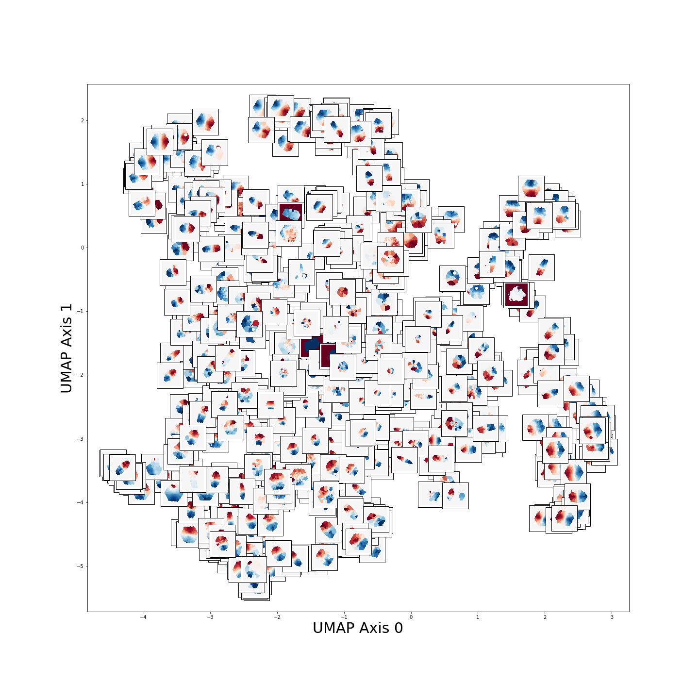

# Machine Learning for MaNGA Kinematic Maps
This repository is a tutorial for running various ML algorithms on MaNGA kinematic maps.

It will focus on clustering analysis for an unsupervised look at stellar velocity map data.

This includes:
1) k-means clustering
2) Various dimensionality reduction and visualization tools (t-SNE, UMAP, SOMs)
3) Gaussian Mixture Models 
4) Hierarchical clustering

