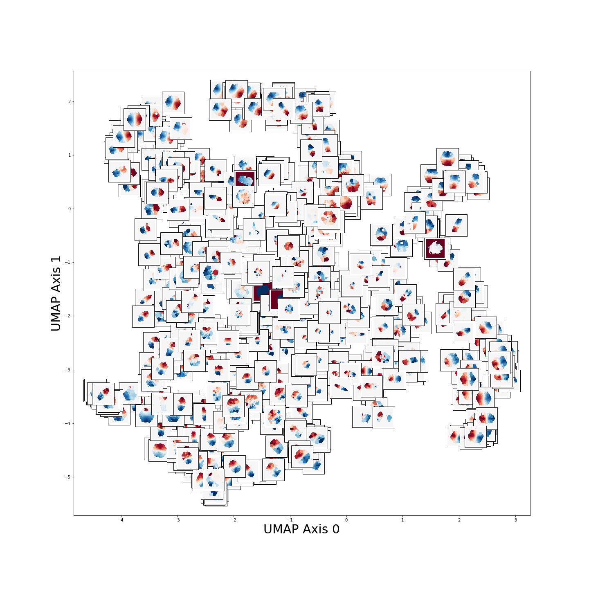
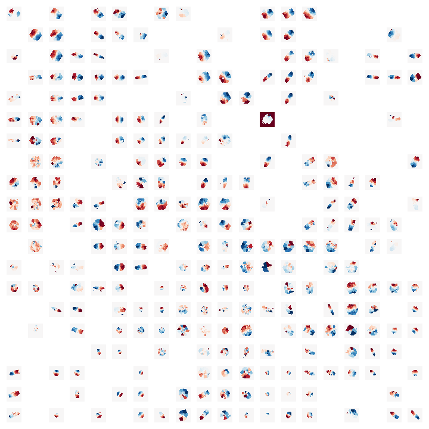

# Machine Learning for MaNGA Kinematic Maps
This repository is a tutorial for running various ML algorithms on MaNGA kinematic maps.

It will focus on clustering analysis for an unsupervised look at stellar velocity map data.

This includes:
1) k-means clustering
2) Various dimensionality reduction and visualization tools (t-SNE, UMAP, SOMs)
3) Gaussian Mixture Models 
4) Hierarchical clustering

There are many different notebooks that accompany this tutorial:
- SFR_Mass_Cluster_IDs.ipynb - feed it a list of clusters and MaNGA IDs and it will show you the cluster centers and distributions in mass/SFR space.
- PCA_on_derotated_and_rescaled.ipynb - runs PCA on the derotated and rescaled images, output can be used for SFR_Mass_Cluster_IDs.ipynb
- PCA_on_derotated.ipynb - runs PCA on the derotated images
- Convolution_Autoencoder.ipynb - uses an autoencoder on derotated (slightly older version of data) maps to create an encoding that it then runs a UMAP on.

